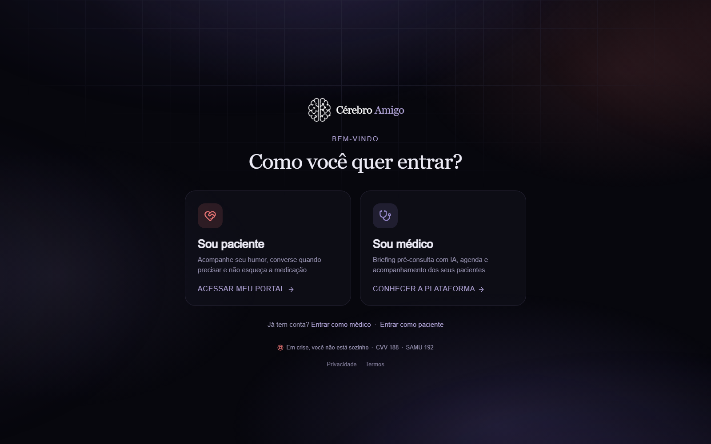
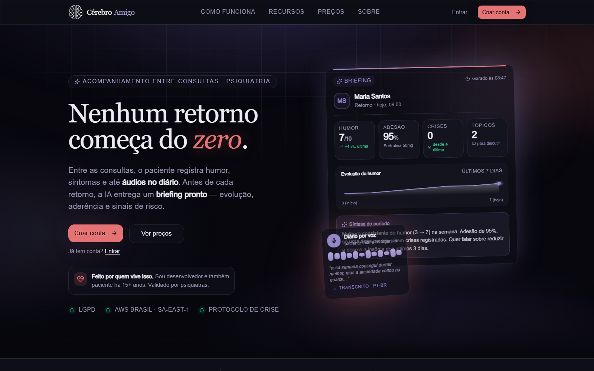
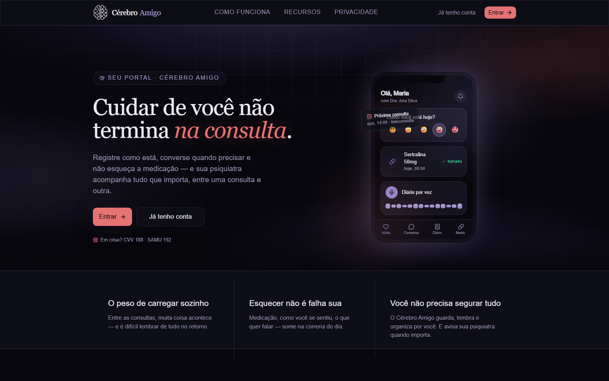
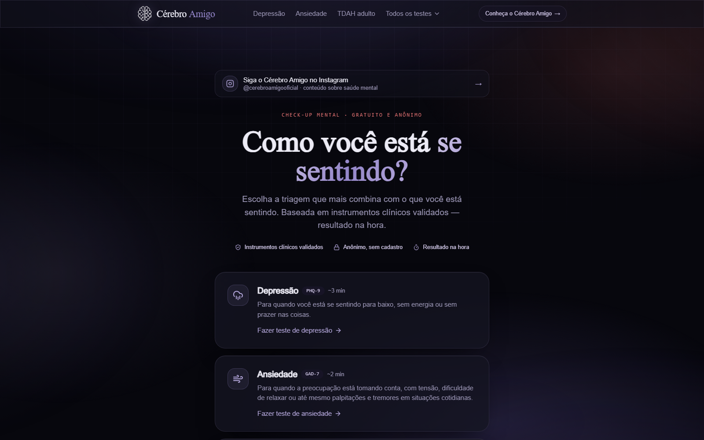
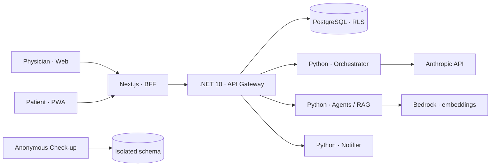

# Cérebro Amigo V3

A demonstration platform for psychiatric care between appointments, designed to connect the patient's daily routine to the physician's decision-making with safety, context, and traceability.

**🇧🇷 [Versão em português](./README.pt-br.md)**

[](./.github/workflows/ci.yml)


<p align="center">
  
</p>

> [!IMPORTANT]
> This is a **portfolio project and a realistic engineering simulation**. It is not an active medical service, contains no real patients, and must not be used for diagnosis, prescription, or emergency care. External integrations require your own credentials and test environments.

## The case in 90 seconds

| | |
|---|---|
| **Problem** | Between appointments, critical information gets scattered: mood, adherence, symptoms, questions, and risk signals. |
| **Product** | A physician dashboard, a patient PWA, and a public anonymous screening experience. |
| **Technical challenge** | Isolate sensitive data per tenant, coordinate services across three stacks, and apply AI without removing the physician from the loop. |
| **Solution** | Next.js for the product and BFF, .NET for the transactional core, Python for the AI flows, and PostgreSQL with Row-Level Security as the last line of isolation. |
| **What this repository demonstrates** | Systems architecture, full-stack development, security by design, product UX, integration testing, and CI/CD. |

The goal is not just to simulate screens. The monorepo implements service boundaries, authentication, auditing, migrations, notifications, asynchronous processing, clinical safeguards, and a reference architecture for AWS in the São Paulo region.

> [!NOTE]
> Product copy and internal documentation (ADRs, runbooks) are written in Brazilian Portuguese — the product targets the Brazilian market and its data-protection law (LGPD). This README summarizes the key engineering decisions in English.

## Product

<p align="center">
  
</p>

<p align="center"><sub>One front door, two journeys, and distinct permissions from the very first interaction.</sub></p>

<table>
  <tr>
    <td width="50%">
      
      <br />
      <sub><strong>Physician experience:</strong> pre-appointment briefing, schedule, medical records, progress notes, and alerts.</sub>
    </td>
    <td width="50%">
      
      <br />
      <sub><strong>Patient experience:</strong> mood tracking, reminders, journaling, check-ins, and assisted conversation.</sub>
    </td>
  </tr>
</table>

<p align="center">
  
</p>

<p align="center"><sub><strong>Mental Check-up:</strong> an anonymous satellite product, fully isolated from the clinical records. All screens use demo content.</sub></p>

## Implemented capabilities

### For the physician

- Dashboard with schedule, patients, messages, check-ins, and progress overview.
- Longitudinal medical record with treatment plans, medications, clinical scales, exams, and a timeline.
- Pre-appointment briefing and an assisted scribe, keeping the physician as the decision-maker.
- Risk alerts with acknowledgment, retry, and a full audit trail.
- Operational views for usage, costs, acquisition, and compliance.

### For the patient

- Responsive PWA with its own session and routine-oriented navigation.
- Mood logging, text or voice journaling, schedule, and medication reminders.
- Check-ins and communication between appointments, supervised and audited.
- Deterministic crisis flow with a static, pre-approved message.

### Mental Check-up

- Public, anonymous screenings based on validated clinical instruments (PHQ-9, GAD-7, ASRS-18).
- Immediate results, never mixed with the clinical records.
- Independent architecture, database schema, and deploy cycle from the clinical product.
- Structured, minimized content at every point that touches an LLM.

## Architecture



Boundaries were drawn by responsibility, not by language preference:

| Layer | Technology | Responsibility |
|---|---|---|
| Product & BFF | Next.js 16, React 19, TypeScript, Tailwind 4 | UI, httpOnly sessions, Route Handlers, and PWA. |
| Transactional core | ASP.NET Core / .NET 10 | REST, JWT, access rules, EF Core, and event proxying. |
| AI & automation | Python 3.12, FastAPI, LangGraph | Orchestration, classification, RAG, jobs, and integrations. |
| Data | PostgreSQL, pgvector, pgcrypto | Relational model, vector search, encryption, and multi-tenant RLS. |
| Delivery | Docker, GitHub Actions, AWS | Reproducible builds, quality gates, and a regionalized architecture. |

For the full map, see [docs/CONTEXT.md](./docs/CONTEXT.md). Architectural decisions are recorded in [docs/adrs](./docs/adrs).

## Decisions worth a technical conversation

1. **Tenant isolation in two layers.** Every clinical query keeps an explicit tenant filter, and PostgreSQL enforces the boundary with Row-Level Security. Integration tests against a real Postgres actively try to cross tenants to prove the defense. See [ADR-042](./docs/adrs/ADR-042-rls-isolamento-tenant.md).

2. **AI kept apart from the transactional domain.** The .NET gateway never calls models directly. AI flows live in the Python services and can swap providers without contaminating the main API. See [ADR-044](./docs/adrs/ADR-044-llm-anthropic-api-direta.md) and [ADR-071](./docs/adrs/ADR-071-manter-dotnet-remover-scala.md).

3. **Crisis handling is deterministic and fail-safe.** The LLM never writes the crisis message. The text is static, hash-verified across two services, and a classification failure is treated as risk — never ignored. See [ADR-035](./docs/adrs/ADR-035-trava-server-side-prompt-crise.md), [ADR-041](./docs/adrs/ADR-041-entrega-garantida-alerta-crise.md), and [ADR-063](./docs/adrs/ADR-063-resiliencia-deteccao-crise-failsafe.md).

4. **Privacy drives the design.** Sensitive content is encrypted at rest, PII is redacted before traces, and direct identifiers never travel alongside clinical content to external APIs. See [ADR-018](./docs/adrs/ADR-018-cifragem-em-repouso.md).

5. **The public funnel never becomes a medical record.** The Mental Check-up uses a separate schema, creates no foreign keys into the clinical domain, and exposes only aggregate metrics when needed.

## Security and clinical responsibility

- AI organizes, classifies, and drafts; it **never diagnoses, prescribes, or adjusts dosage**.
- Every response to a patient is auditable and can be escalated to a human.
- The crisis protocol uses fixed content with guaranteed, retried delivery.
- Critical audit records are immutable by domain rule.
- Session cookies are `httpOnly`; internal services authenticate with a dedicated token.
- Secrets come from environment variables and never belong in code, images, or logs.
- The pipeline runs vulnerability scans and blocks fixable critical findings.

This section describes decisions implemented in the case study; it does not represent regulatory certification or validation for real clinical use.

## Verifiable quality

| Area | Main gate | What it protects |
|---|---|---|
| Web | `pnpm build` | Strict TypeScript, React, and Next.js rendering. |
| Check-up | `pnpm test` + `pnpm build` | The scale engine and the public experience. |
| Gateway | `dotnet build` + `dotnet test` | Contracts, authorization, RLS, and integration with a real Postgres via Testcontainers. |
| Python services | `ruff`, `mypy`, `pytest` | AI flows, crisis handling, redaction, and jobs. |
| Repository | Trivy + smoke tests | Critical dependencies and cross-service integration. |

The repository keeps versioned SQL migrations as the single source of truth for the schema, plus a CI suite in [`.github/workflows/ci.yml`](./.github/workflows/ci.yml).

## Monorepo structure

```text
apps/
├── web/                 Next.js — landing, dashboard, PWA, and BFF
├── checkup/             Next.js — public anonymous screening
├── api-gateway/         .NET 10 — transactional API and authorization
├── api-gateway-tests/   xUnit + Testcontainers
├── orchestrator-py/     FastAPI + LangGraph — conversation and crisis
├── agents-py/           FastAPI — analytical agents and RAG
└── notifier-py/         FastAPI — push, e-mail, and retries

infra/
├── migrations/          Versioned PostgreSQL DDL
├── aws/                 Reference architecture and automation
└── ci/                  Integration scripts and smoke tests

docs/
├── CONTEXT.md           Technical map of the system
├── DEBT.md              Explicit technical debt
├── adrs/                Architectural decision records
└── runbooks/            Simulated operational procedures
```

`apps/api-gateway-scala` is decommissioned code preserved purely as historical record; the active gateway is .NET 10.

## Running locally

### Prerequisites

- Node.js 24 and pnpm 10.33.3 via Corepack
- .NET 10 SDK
- Python 3.12+
- Docker with Compose

### Quick look at the interface

```bash
corepack pnpm@10.33.3 install --frozen-lockfile
corepack pnpm@10.33.3 --filter @cerebro-amigo/web dev
```

The web app opens at `http://localhost:3000`. In another terminal, the Mental Check-up can be started at `http://localhost:3001`:

```bash
corepack pnpm@10.33.3 --filter @cerebro-amigo/checkup dev
```

### Full stack

```bash
cp .env.example .env
docker compose up -d --build
```

`.env.example` documents every variable. Use only your own sandbox/development credentials and fictional data. Some flows depend on external providers and will remain unavailable without that configuration.

## Intentional limits of the case study

- No real patient data should ever be entered.
- All screens and scenarios shown use fictional information.
- The AWS infrastructure represents a plausible topology, not a statement of an active clinical environment.
- Clinical scales and safeguards were treated as controlled artifacts, but real-world use would require independent legal, clinical, security, and privacy validation.
- Open debts and pending decisions are kept explicit in [docs/DEBT.md](./docs/DEBT.md).

---

Built as a product-engineering case study to demonstrate real decisions — including the limits, the risks, and the trade-offs that usually stay out of a UI demo.
