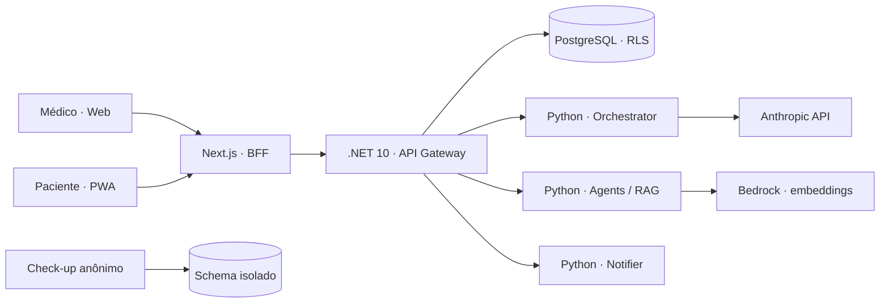

# Cérebro Amigo V3

Plataforma demonstrativa de acompanhamento psiquiátrico entre consultas, desenhada para conectar a rotina do paciente à tomada de decisão do médico com segurança, contexto e rastreabilidade.

[](./.github/workflows/ci.yml)


<p align="center">
  
</p>

> [!IMPORTANT]
> Este é um **projeto de portfólio e uma simulação realista de engenharia**. Não é um serviço médico ativo, não contém pacientes reais e não deve ser usado para diagnóstico, prescrição ou atendimento de emergência. Integrações externas dependem de credenciais próprias e ambientes de teste.

## O case em 90 segundos

| | |
|---|---|
| **Problema** | Entre consultas, informações importantes ficam dispersas: humor, adesão, sintomas, dúvidas e sinais de risco. |
| **Produto** | Dashboard médico, PWA do paciente e uma experiência pública de triagem anônima. |
| **Desafio técnico** | Isolar dados sensíveis por tenant, coordenar serviços em três stacks e aplicar IA sem retirar o médico do processo. |
| **Solução** | Next.js no produto e no BFF, .NET no núcleo transacional, Python nos fluxos de IA e PostgreSQL com RLS como última linha de isolamento. |
| **O que o repositório demonstra** | Arquitetura de sistemas, desenvolvimento full-stack, segurança por design, UX de produto, testes de integração e CI/CD. |

O objetivo não é apenas simular telas. O monorepo implementa fronteiras de serviço, autenticação, auditoria, migrações, notificações, processamento assíncrono, salvaguardas clínicas e uma arquitetura de referência para AWS na região de São Paulo.

## Produto

<p align="center">
  
</p>

<p align="center"><sub>Uma porta de entrada, duas jornadas e permissões diferentes desde o primeiro contato.</sub></p>

<table>
  <tr>
    <td width="50%">
      
      <br />
      <sub><strong>Experiência médica:</strong> briefing pré-consulta, agenda, prontuário, evolução e alertas.</sub>
    </td>
    <td width="50%">
      
      <br />
      <sub><strong>Experiência do paciente:</strong> humor, lembretes, diário, check-ins e conversa assistida.</sub>
    </td>
  </tr>
</table>

<p align="center">
  
</p>

<p align="center"><sub><strong>Check-up Mental:</strong> produto-satélite anônimo e isolado do prontuário clínico. As telas usam conteúdo demonstrativo.</sub></p>

## Capacidades implementadas

### Para o médico

- Dashboard com agenda, pacientes, mensagens, check-ins e visão de evolução.
- Prontuário longitudinal com condutas, medicações, escalas, exames e timeline.
- Briefing pré-consulta e escriba assistido, mantendo o médico como decisor.
- Alertas de risco com confirmação, retentativa e trilha de auditoria.
- Visões operacionais de uso, custos, aquisição e conformidade.

### Para o paciente

- PWA responsiva com sessão própria e navegação orientada à rotina.
- Registro de humor, diário por texto ou voz, agenda e lembretes de medicação.
- Check-ins e comunicação entre consultas com supervisão e auditoria.
- Fluxo de crise determinístico, com mensagem estática pré-aprovada.

### Check-up Mental

- Triagens públicas e anônimas com instrumentos clínicos validados.
- Resultado imediato, sem misturar os dados com o prontuário.
- Arquitetura, schema e ciclo de deploy independentes do produto clínico.
- Conteúdo estruturado e minimizado nos pontos que usam LLM.

## Arquitetura



As fronteiras foram escolhidas por responsabilidade, não por preferência de linguagem:

| Camada | Tecnologia | Responsabilidade |
|---|---|---|
| Produto e BFF | Next.js 16, React 19, TypeScript, Tailwind 4 | UI, sessão httpOnly, Route Handlers e PWA. |
| Núcleo transacional | ASP.NET Core / .NET 10 | REST, JWT, regras de acesso, EF Core e proxy de eventos. |
| IA e automações | Python 3.12, FastAPI, LangGraph | Orquestração, classificação, RAG, jobs e integrações. |
| Dados | PostgreSQL, pgvector, pgcrypto | Modelo relacional, busca vetorial, cifragem e RLS multi-tenant. |
| Entrega | Docker, GitHub Actions, AWS | Builds reproduzíveis, gates de qualidade e arquitetura regionalizada. |

Para o mapa completo, consulte [docs/CONTEXT.md](./docs/CONTEXT.md). As decisões arquiteturais são registradas em [docs/adrs](./docs/adrs).

## Decisões que rendem uma boa conversa técnica

1. **Tenant isolado em duas camadas.** Toda consulta clínica mantém filtro explícito e o PostgreSQL reforça o limite com Row-Level Security. Testes com Postgres real tentam atravessar tenants e provar a defesa. Veja [ADR-042](./docs/adrs/ADR-042-rls-isolamento-tenant.md).

2. **IA separada do domínio transacional.** O gateway .NET não chama modelos diretamente. Fluxos de IA vivem nos serviços Python e podem trocar de provedor sem contaminar a API principal. Veja [ADR-044](./docs/adrs/ADR-044-llm-anthropic-api-direta.md) e [ADR-071](./docs/adrs/ADR-071-manter-dotnet-remover-scala.md).

3. **Crise é caminho determinístico e fail-safe.** A LLM nunca redige a mensagem de crise. O texto é estático, verificado por hash em dois serviços, e uma falha de classificação é tratada como risco — nunca ignorada. Veja [ADR-035](./docs/adrs/ADR-035-trava-server-side-prompt-crise.md), [ADR-041](./docs/adrs/ADR-041-entrega-garantida-alerta-crise.md) e [ADR-063](./docs/adrs/ADR-063-resiliencia-deteccao-crise-failsafe.md).

4. **Privacidade orienta o desenho.** Conteúdo sensível é cifrado, PII é redatada antes dos traces e identificadores diretos não viajam com conteúdo clínico para APIs externas. Veja [ADR-018](./docs/adrs/ADR-018-cifragem-em-repouso.md).

5. **O funil público não vira prontuário.** O Check-up Mental usa schema separado, não cria chaves estrangeiras para o domínio clínico e expõe apenas métricas agregadas quando necessário.

## Segurança e responsabilidade clínica

- IA organiza, classifica e rascunha; **não diagnostica, prescreve ou ajusta dose**.
- Toda resposta ao paciente é auditável e pode ser escalada para uma pessoa.
- O protocolo de crise usa conteúdo fixo e entrega com retentativa.
- Registros críticos de auditoria são imutáveis por regra de domínio.
- Cookies de sessão são `httpOnly`; serviços internos usam token dedicado.
- Segredos entram por variáveis de ambiente e não pertencem ao código, às imagens ou aos logs.
- O pipeline executa scan de vulnerabilidades e bloqueia achados críticos corrigíveis.

Essa seção descreve decisões implementadas no case; não representa certificação regulatória nem validação para uso clínico real.

## Qualidade verificável

| Área | Gate principal | O que protege |
|---|---|---|
| Web | `pnpm build` | TypeScript strict, React e renderização do Next.js. |
| Check-up | `pnpm test` + `pnpm build` | Motor das escalas e experiência pública. |
| Gateway | `dotnet build` + `dotnet test` | Contratos, autorização, RLS e integração com Postgres real via Testcontainers. |
| Serviços Python | `ruff`, `mypy`, `pytest` | Fluxos de IA, crise, redaction e jobs. |
| Repositório | Trivy + smoke tests | Dependências críticas e integração entre serviços. |

O repositório mantém migrações SQL versionadas como fonte da verdade do schema e uma suíte de CI em [`.github/workflows/ci.yml`](./.github/workflows/ci.yml).

## Estrutura do monorepo

```text
apps/
├── web/                 Next.js — landing, dashboard, PWA e BFF
├── checkup/             Next.js — triagem pública anônima
├── api-gateway/         .NET 10 — API transacional e autorização
├── api-gateway-tests/   xUnit + Testcontainers
├── orchestrator-py/     FastAPI + LangGraph — conversa e crise
├── agents-py/           FastAPI — agentes analíticos e RAG
└── notifier-py/         FastAPI — push, e-mail e retentativas

infra/
├── migrations/          DDL versionado do PostgreSQL
├── aws/                 Arquitetura de referência e automações
└── ci/                  Scripts de integração e smoke tests

docs/
├── CONTEXT.md           Mapa técnico do sistema
├── DEBT.md              Dívida técnica explícita
├── adrs/                Registro das decisões arquiteturais
└── runbooks/            Procedimentos operacionais simulados
```

`apps/api-gateway-scala` é código descomissionado preservado apenas como registro histórico; o gateway ativo é .NET 10.

## Rodando localmente

### Pré-requisitos

- Node.js 24 e pnpm 10.33.3 via Corepack
- .NET 10 SDK
- Python 3.12+
- Docker com Compose

### Visão rápida da interface

```bash
corepack pnpm@10.33.3 install --frozen-lockfile
corepack pnpm@10.33.3 --filter @cerebro-amigo/web dev
```

A aplicação web abre em `http://localhost:3000`. Em outro terminal, o Check-up Mental pode ser iniciado em `http://localhost:3001`:

```bash
corepack pnpm@10.33.3 --filter @cerebro-amigo/checkup dev
```

### Stack completa

```bash
cp .env.example .env
docker compose up -d --build
```

O `.env.example` documenta todas as variáveis. Use somente credenciais próprias de sandbox/desenvolvimento e dados fictícios. Alguns fluxos dependem de provedores externos e permanecerão indisponíveis sem essas configurações.

## Limites intencionais do case

- Nenhum dado real de paciente deve ser inserido.
- As telas e cenários apresentados usam informações fictícias.
- A infraestrutura AWS representa uma topologia plausível, não uma declaração de ambiente clínico ativo.
- Escalas e salvaguardas foram tratadas como artefatos controlados, mas uso real exigiria validação jurídica, clínica, de segurança e privacidade independente.
- Débitos e decisões ainda abertas são mantidos de forma explícita em [docs/DEBT.md](./docs/DEBT.md).

---

Construído como um case de engenharia de produto para demonstrar decisões reais — inclusive os limites, os riscos e os trade-offs que normalmente ficam fora de uma demo de interface.
